  

  
  

I build and study machine learning systems: deep learning models, LLM and retrieval pipelines, and data-driven analysis. I care about how a system behaves, not just whether it runs: where it fails and how to measure it.

**Interests:** deep learning · NLP and LLMs · retrieval and knowledge graphs · speech and audio · data science

## Projects

| Project | What it is | Stack |
|---|---|---|
| [Global-context narrative reasoning](https://github.com/aryasm13/KDSH) | Checks whether a character backstory is consistent with a full-length novel, using evidence, thematic and temporal memory layers with iterative retrieval. Built on the open-source [ComoRAG](https://github.com/EternityJune25/ComoRAG) framework. First Runner-Up, Kharagpur Data Science Hackathon 6.0, IIT Kharagpur. | Python, BGE embeddings, knowledge graphs, GPT-4o-mini |
| [Hybrid quantum federated learning](https://github.com/aryasm13/hybrid-qfl-noniid) | Studies how skewed (non-IID) client data degrades federated training when each client runs a hybrid quantum-classical model, and tests proximal regularisation and entropy-weighted aggregation as fixes. | PyTorch, PennyLane |
| [Audio deepfake detection](https://github.com/aryasm13/Audio-Deepfake-Detection) | LSTM + Transformer-encoder classifier for real vs synthetic speech, trained on 68,889 samples with MFCC, chroma and spectral features. Part of a three-model comparison. | TensorFlow/Keras, librosa, scikit-learn |
| [Retail pharmacy analytics](https://github.com/aryasm13/bdm-capstone-retail-pharmacy-analytics) | IIT Madras capstone on first-hand data from a retail pharmacy: working-capital analysis, cash-flow forecasting, and safety-stock and reorder-point models for 20 medicines. | Statistics, forecasting, Excel |
| [Learning collapse detection](https://github.com/aryasm13/Learning-Collapse-Detection) | Streaming pipeline that flags declining student engagement from clickstream data. Big Data Analytics course project. | Spark, Python, Next.js |

## Experience

**Applied AI Engineer Intern, Jurident AI.** Worked on a legal research platform: multilingual support across 8 Indian languages, multi-document retrieval, and testing for hallucinated precedents.

## Tools I use

  
  
  
  
  
  
  
  
  
  

